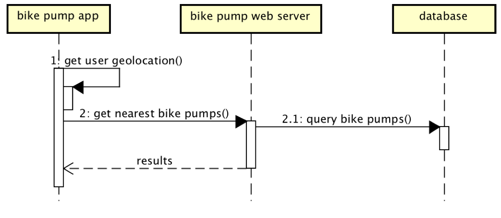

# Design

## Behavioural design
TODO: Describe a concrete scenario for each use-case. 
Describe it in terms of interactions between the components introduces above, and the actors introduced in your requirements.

## User Interface design
This is a rough idea of what the overall webpage will look like. Some of the design may be altered at the final stage of implementation. 
Our initial design includes:
- Home
- Popular Museums
- Museum List
- Map

